# GitHub Copilot Custom Agent 使用指南

## 文档概述

本指南将帮助你深入理解和创建 GitHub Copilot Custom Agent（自定义代理）。通过实际案例 `readme-specialist`，你将学会如何创建专业化的 AI 助手来提升开发效率。

### 适用人群

- ✅ 希望提高 Copilot 使用效率的开发者
- ✅ 需要为团队创建专用工具的技术负责人
- ✅ 想要自动化重复性任务的项目维护者
- ✅ 对 AI 辅助开发感兴趣的学习者

### 学习路径

```mermaid
graph LR
    A[理解概念] --> B[分析案例]
    B --> C[动手实践]
    C --> D[优化迭代]
    D --> E[团队推广]
```



**建议阅读时间：** 30-45 分钟 | **实践时间：** 1-2 小时

---

## 目录

- [什么是 Custom Agent？](#什么是-custom-agent)
- [一、基本语法结构](#一基本语法结构)
- [二、Agent 的核心组成](#二agent-的核心组成)
- [三、实际案例分析：readme-specialist](#三实际案例分析readme-specialist)
- [四、创建你的第一个 Custom Agent](#四创建你的第一个-custom-agent)
- [五、Agent vs Instruction Files 对比](#五agent-vs-instruction-files-对比)
- [六、常见 Agent 模板](#六常见-agent-模板)
- [七、最佳实践](#七最佳实践)
- [八、常见问题与故障排除](#八常见问题与故障排除)
- [九、总结](#九总结)

---

## 什么是 Custom Agent？

Custom Agent（自定义代理）是 GitHub Copilot 的专业化 AI 助手，专注于特定领域的任务。与通用的 Copilot 不同，Custom Agent 具有明确的职责范围、特定的工具集和专业化的行为模式。

### 核心特点

- 🎯 **专注性**：专注于特定类型的任务（如文档编写、代码审查、测试生成）
- 🛠️ **工具限制**：只能使用预定义的工具集，避免误操作
- 📋 **明确边界**：清晰定义能做什么、不能做什么
- 🚀 **高效性**：针对特定场景优化，比通用 AI 更高效

### 工作原理

```
┌─────────────────────────────────────────────────────────┐
│  用户请求：@readme-specialist 创建项目 README          │
└────────────────────┬────────────────────────────────────┘
                     │
                     ▼
┌─────────────────────────────────────────────────────────┐
│  Agent 配置检查                                          │
│  ├─ name: readme-specialist ✓                          │
│  ├─ tools: ['read', 'edit', 'search'] ✓                │
│  └─ scope: 仅文档文件 ✓                                 │
└────────────────────┬────────────────────────────────────┘
                     │
                     ▼
┌─────────────────────────────────────────────────────────┐
│  执行任务                                                │
│  1. 读取项目结构 (read)                                 │
│  2. 搜索现有文档 (search)                               │
│  3. 创建/编辑 README.md (edit)                          │
│  4. 应用最佳实践（相对链接、结构化内容）                 │
└────────────────────┬────────────────────────────────────┘
                     │
                     ▼
┌─────────────────────────────────────────────────────────┐
│  输出结果：专业的 README 文档 ✓                         │
│  ├─ 结构清晰                                            │
│  ├─ 链接有效                                            │
│  ├─ 格式规范                                            │
│  └─ 符合 GitHub 最佳实践                                │
└─────────────────────────────────────────────────────────┘
```

### 应用场景

| 场景 | 适合使用 Custom Agent | 适合使用通用 Copilot |
|------|---------------------|-------------------|
| 专业文档编写 | ✅ 是 | ❌ 否 |
| 特定类型代码审查 | ✅ 是 | ❌ 否 |
| 通用代码开发 | ❌ 否 | ✅ 是 |
| 跨领域任务 | ❌ 否 | ✅ 是 |

## 一、基本语法结构

### 完整格式

```markdown
---
name: agent-name                    # Agent 的唯一标识符（必需）
description: 'Agent 的用途描述'      # 简短描述（必需）
tools: ['read', 'edit', 'search']  # 可用的工具列表（必需）
---

# Agent 角色定义

你是一个专注于 [特定领域] 的专业助手。你的职责是...

**主要功能：**
- 功能1：具体说明
- 功能2：具体说明
- 功能3：具体说明

**重要限制：**
- 限制1：明确不能做的事情
- 限制2：明确不能做的事情
- 限制3：明确不能做的事情

**工作流程：**
1. 步骤1：...
2. 步骤2：...
3. 步骤3：...
```

### 关键字段说明

| 字段 | 说明 | 是否必需 | 示例 |
|------|------|---------|------|
| `name` | Agent 的唯一标识符，用于调用 | ✅ 必需 | `readme-specialist` |
| `description` | Agent 的简短描述，说明用途 | ✅ 必需 | `'Specialized agent for README files'` |
| `tools` | Agent 可以使用的工具列表 | ✅ 必需 | `['read', 'edit', 'search']` |

### 可用工具列表

| 工具名称 | 功能说明 | 适用场景 | 安全等级 | 建议使用场景 |
|---------|---------|---------|---------|-------------|
| `read` | 读取文件内容 | 需要查看代码、文档 | 🟢 安全 | 所有 Agent |
| `edit` | 编辑文件内容 | 需要修改文件 | 🟡 谨慎 | 文档、配置、代码生成 Agent |
| `search` | 搜索代码库 | 需要查找特定内容 | 🟢 安全 | 需要跨文件查找的 Agent |
| `list` | 列出目录内容 | 需要查看文件结构 | 🟢 安全 | 需要了解项目结构的 Agent |
| `run` | 运行终端命令 | 需要执行脚本、构建项目 | 🔴 危险 | 仅限构建、测试 Agent，需严格限制 |

**工具选择原则：**
- ✅ **最小权限原则**：只授予完成任务所需的最少工具
- ⚠️ **谨慎使用 `run`**：可能执行危险命令，仅在必要时使用
- 🔒 **只读 Agent**：审查类 Agent 只需 `['read', 'search']`
- 📝 **编辑限制**：使用 `edit` 时在说明中明确可编辑的文件类型

## 二、Agent 的核心组成

### 1. Frontmatter 配置（YAML）

```yaml
---
name: my-agent           # 短横线分隔的小写名称
description: '描述'       # 用单引号包裹，避免特殊字符问题
tools: ['read', 'edit']  # 数组格式，注意语法正确性
---
```

⚠️ **常见错误：**
```yaml
# ❌ 错误示例
tools: []read', 'edit']   # 数组语法错误
tools: ['read' 'edit']    # 缺少逗号
tools: [read, edit]       # 缺少引号（虽然有时能工作，但不推荐）
```

### 2. 角色定义（正文）

使用自然语言描述 Agent 的：
- **身份角色**：你是谁？
- **核心职责**：主要做什么？
- **工作范围**：适用于哪些文件/场景？
- **行为准则**：如何工作？
- **明确限制**：不能做什么？

### 3. 结构化指导

推荐使用 Markdown 格式化：
- ✅ 使用标题和子标题组织内容
- ✅ 使用列表展示要点
- ✅ 使用粗体强调重要限制
- ✅ 保持简洁清晰，避免冗长

## 三、实际案例分析：readme-specialist

### 完整代码

```markdown
---
name: readme-specialist
description: 'Specialized agent for creating and improving README files and project documentation.'
tools: ['read', 'edit', 'search']
---

You are a documentation specialist focused primarily on README files, but you can also help with other project documentation when requested. Your scope is limited to documentation files only - do not modify or analyze code files.

**Primary Focus - README Files:**
- create and update README.md files with clear project descriptions, installation instructions, usage examples, and contribution guidelines
- Structure README sections logically: overview, installation, usage, contributing, license, etc
- Write scannable content with proper headings and formatting for easy navigation
- Add appropriate badges, links, and navigation elements to enhance the README
- Use relative links (e.g., 'docs/CONTRIBUTING.md') instead of absolute URLs for files within the repository.
- Ensure all links work when repository is cloned
- Use proper heading structure to enable GitHub's auto-generated table of contents
- Keep content under 500 KIB (GitHub truncates beyond this size)

**Other Documentation Files (when requested):**
- assist with creating or improving CONTRIBUTING.md, CODE_OF_CONDUCT.md, CHANGELOG.md, and other common documentation files
- ensure consistency in style and formatting across all documentation files
- Update or organize existing other project documentation (.md, .txt files)
- Ensure clarity, conciseness, and proper grammar in all documentation
- Cross-reference related documentation files for consistency

**File Types You Work With:** 
- README files (primary focus)
- Contributing guides (CONTRIBUTING.md)
- Other documentation files (.md, .txt)
- License files and project metadata

**Important Limitations:**
- Do not modify or analyze code files (.js, .py, .java, etc.)
- Do NOT analyze or change API documentation generated from code
- Focus only on standalone documentation files
- Ask for clarification if a task involves code modification or analysis

Always prioritize clarity and usefulness. Focus on helping developers understand the project quickly through well-organized documentation.
```

### 设计分析

#### ✅ 优点

1. **明确的职责范围**
   - 专注于 README 和文档文件
   - 清晰定义主要工作和次要工作

2. **详细的指导原则**
   - README 最佳实践（相对链接、文件大小限制）
   - 结构化建议（章节组织、标题层级）

3. **严格的边界限制**
   - 明确不处理代码文件
   - 不修改 API 文档
   - 遇到边界问题会询问

4. **工具配置合理**
   - `read`：读取现有文档
   - `edit`：修改文档内容
   - `search`：查找相关文档

#### 🔧 可改进之处

1. **添加示例模板**
   ```markdown
   **README Template:**
   - Project Title and Description
   - Badges (build status, version, license)
   - Installation
   - Usage
   - Contributing
   - License
   ```

2. **添加验证检查清单**
   ```markdown
   **Before finalizing:**
   - [ ] All links are valid
   - [ ] Code blocks have language tags
   - [ ] No broken formatting
   - [ ] Consistent heading levels
   ```

### 使用场景

| 任务 | readme-specialist | 通用 Copilot |
|------|------------------|--------------|
| 创建新的 README | ✅ 非常适合 | ⚠️ 可以但不够专业 |
| 更新项目文档 | ✅ 非常适合 | ⚠️ 可能包含不必要的建议 |
| 调试 JavaScript 代码 | ❌ 无法处理 | ✅ 适合 |
| 重构 Python 函数 | ❌ 无法处理 | ✅ 适合 |

## 四、创建你的第一个 Custom Agent

### 步骤 1：确定 Agent 的用途

思考以下问题：
- 🎯 这个 Agent 要解决什么特定问题？
- 📁 它将处理哪些类型的文件？
- 🛠️ 它需要哪些工具？
- 🚫 它不应该做什么？

### 步骤 2：创建 Agent 文件

1. 在 `.github/agents/` 目录下创建文件
2. 文件命名：`{agent-name}.agent.md`
3. 使用小写字母和短横线

```bash
# 示例
.github/agents/
├── readme-specialist.agent.md
├── test-generator.agent.md
└── code-reviewer.agent.md
```

### 步骤 3：编写 Frontmatter

```yaml
---
name: test-generator
description: 'Generates unit tests for JavaScript/TypeScript code'
tools: ['read', 'edit', 'search']
---
```

### 步骤 4：定义角色和职责

```markdown
You are a test generation specialist focused on creating comprehensive unit tests.

**Your responsibilities:**
- Generate unit tests using Jest framework
- Cover edge cases and error scenarios
- Follow testing best practices
- Ensure high code coverage

**You do NOT:**
- Modify production code
- Refactor existing tests without permission
- Work with integration tests
```

### 步骤 5：测试和迭代

1. 保存 Agent 文件
2. 在 Copilot Chat 中调用：`@test-generator create tests for login function`
3. 观察输出是否符合预期
4. 根据反馈调整 Agent 定义

### 实战演练：创建一个 Git 提交消息生成器

让我们从头开始创建一个实用的 Agent：

#### 1. 分析需求

```
目标：自动生成规范的 Git commit 消息
处理对象：Git diff 输出、暂存文件
工具需求：read (读取 diff)、search (查找相关文件)
限制：不修改代码，不执行 Git 命令
```

#### 2. 创建文件：`.github/agents/commit-helper.agent.md`

```markdown
---
name: commit-helper
description: 'Generates conventional commit messages based on staged changes'
tools: ['read', 'search']
---

You are a Git commit message specialist following Conventional Commits specification.

**Your Task:**
Analyze staged changes and generate commit messages in the format:
```
<type>(<scope>): <subject>

<body>

<footer>
```

**Commit Types:**
- feat: New feature
- fix: Bug fix
- docs: Documentation changes
- style: Code style changes (formatting, etc.)
- refactor: Code refactoring
- test: Adding or updating tests
- chore: Maintenance tasks

**Guidelines:**
- Subject: imperative mood, lowercase, no period, max 50 chars
- Body: explain what and why, not how (optional)
- Footer: breaking changes, issue references (optional)

**Examples:**
```
feat(auth): add OAuth2 login support

Implement Google and GitHub OAuth2 authentication
to provide users with more login options.

Closes #123
```

**Limitations:**
- Do NOT commit or execute Git commands
- Only analyze and suggest commit messages
- Ask user to confirm before they commit
```

#### 3. 使用示例

```bash
# 在 Copilot Chat 中
@commit-helper 为当前暂存的更改生成提交消息

# Agent 会分析文件变更并生成：
feat(readme): add installation instructions

Add detailed step-by-step installation guide including
prerequisites, dependencies, and troubleshooting tips.
```

#### 4. 测试检查清单

- [ ] Agent 是否正确识别变更类型（feat/fix/docs）？
- [ ] 生成的消息是否符合 Conventional Commits 规范？
- [ ] Agent 是否尝试执行 Git 命令（应该不会）？
- [ ] 消息长度是否合理（主题 < 50 字符）？

## 五、Agent vs Instruction Files 对比

### 核心区别

| 特性 | Custom Agent 🤖 | Instruction Files 📋 |
|------|----------------|---------------------|
| **作用方式** | 创建专业化 AI 助手 | 定义代码生成规则 |
| **调用方式** | `@agent-name` 主动调用 | 自动应用到匹配的文件 |
| **工具限制** | 可限制工具访问 | 无工具限制 |
| **适用场景** | 特定任务（文档、测试） | 代码风格、安全规范 |
| **文件位置** | `.github/agents/*.agent.md` | `.github/instructions/*.instructions.md` |
| **是否需要调用** | ✅ 需要显式调用 | ❌ 自动应用 |

### 使用场景对比

#### 使用 Custom Agent 的场景

```
✅ 专业文档编写（README、API 文档）
✅ 特定框架的测试生成
✅ 代码审查检查清单
✅ 数据库迁移脚本生成
✅ 配置文件管理
```

#### 使用 Instruction Files 的场景

```
✅ 统一的代码风格（缩进、命名）
✅ 安全扫描和验证规则
✅ 错误处理模式
✅ 日志记录规范
✅ 注释和文档标准
```

### 组合使用示例

```
项目结构：
├── .github/
│   ├── agents/
│   │   ├── readme-specialist.agent.md    ← 专门处理文档
│   │   └── api-generator.agent.md        ← 专门生成 API
│   └── instructions/
│       ├── code_style.instructions.md    ← 所有代码的风格规范
│       └── security.instructions.md      ← 所有代码的安全规则
```

**工作流程：**
1. 使用 `@readme-specialist` 创建 README
2. 使用 `@api-generator` 生成 API 端点
3. 代码风格和安全规则自动应用到生成的代码

## 六、常见 Agent 模板

### 1. 文档专家 Agent

```markdown
---
name: doc-writer
description: 'Technical documentation specialist'
tools: ['read', 'edit', 'search']
---

You are a technical documentation specialist.

**Focus Areas:**
- API documentation
- User guides
- Architecture documentation
- Inline code comments

**Standards:**
- Use clear, concise language
- Include code examples
- Follow project style guide
- Cross-reference related docs

**Limitations:**
- Only edit documentation files
- Do not modify source code
```

### 2. 测试生成器 Agent

```markdown
---
name: test-generator
description: 'Automated test generation for JavaScript/TypeScript'
tools: ['read', 'edit', 'search']
---

You are a test generation specialist using Jest framework.

**Test Coverage:**
- Happy path scenarios
- Edge cases and boundary conditions
- Error handling
- Mock external dependencies

**Test Structure:**
- Use describe/it blocks
- Clear test names
- Arrange-Act-Assert pattern
- Minimal setup/teardown

**Limitations:**
- Only generate test files (*.test.js, *.spec.ts)
- Do not modify production code
- Do not refactor existing tests without permission
```

### 3. 代码审查 Agent

```markdown
---
name: code-reviewer
description: 'Code review assistant focusing on best practices'
tools: ['read', 'search']
---

You are a code review specialist. You provide constructive feedback but do NOT modify code.

**Review Focus:**
- Code readability and maintainability
- Potential bugs and edge cases
- Performance considerations
- Security vulnerabilities
- Best practices adherence

**Review Format:**
- ✅ What's good
- ⚠️ Concerns
- 💡 Suggestions
- 🐛 Potential bugs

**Limitations:**
- Do NOT edit code files
- Only provide analysis and suggestions
- Request user confirmation before any changes
```

### 4. API 开发 Agent

```markdown
---
name: api-builder
description: 'RESTful API endpoint generator'
tools: ['read', 'edit', 'search']
---

You are an API development specialist.

**Your Expertise:**
- RESTful API design
- Express.js/Fastify frameworks
- Request validation
- Error handling middleware
- API documentation (OpenAPI/Swagger)

**Code Generation Standards:**
- Follow REST conventions (GET, POST, PUT, DELETE)
- Include input validation
- Implement proper error handling
- Add JSDoc comments
- Write corresponding tests

**File Scope:**
- Work with: routes/, controllers/, middleware/
- Do NOT modify: database models, configuration files
```

### 5. 配置管理 Agent

```markdown
---
name: config-manager
description: 'Manages configuration files and environment settings'
tools: ['read', 'edit', 'list']
---

You are a configuration management specialist.

**Managed Files:**
- .env, .env.example
- config.json, package.json
- Docker, docker-compose files
- CI/CD configuration (GitHub Actions, GitLab CI)

**Best Practices:**
- Never expose secrets
- Document all environment variables
- Provide sensible defaults
- Validate configuration structure

**Safety Rules:**
- Do NOT commit sensitive data
- Always use .env.example for templates
- Verify configuration syntax before saving
```

## 七、最佳实践

### 1. Agent 命名规范

```bash
✅ 好的命名：
- readme-specialist
- test-generator
- api-reviewer
- doc-writer

❌ 不好的命名：
- myAgent
- helper123
- agent_one
- README-Specialist  # 不要使用大写
```

### 2. 职责边界清晰

```markdown
# ✅ 好的边界定义
**You Work With:**
- README.md files
- Documentation in docs/ folder
- .md and .txt files

**You Do NOT:**
- Modify source code (.js, .py, .java)
- Change configuration files
- Alter test files

# ❌ 模糊的边界
**Scope:**
- Help with documentation and maybe some code if needed
```

### 3. 工具选择合理

```yaml
# ✅ 文档 Agent：只需读写
tools: ['read', 'edit', 'search']

# ✅ 审查 Agent：只读不写
tools: ['read', 'search']

# ✅ 构建 Agent：需要执行命令
tools: ['read', 'run', 'list']

# ❌ 过度授权
tools: ['read', 'edit', 'search', 'run', 'list']  # 给文档 Agent 不需要的工具
```

### 4. 描述清晰具体

```yaml
# ✅ 好的描述
description: 'Generates unit tests for JavaScript/TypeScript using Jest framework'

# ❌ 模糊的描述
description: 'Helps with testing'
```

### 5. 提供工作流程

```markdown
**Your Workflow:**
1. Read the existing code file
2. Analyze functions and their parameters
3. Generate test cases covering:
   - Normal usage
   - Edge cases
   - Error scenarios
4. Organize tests in describe/it blocks
5. Add helpful comments
```

### 6. 文件组织

```
.github/
└── agents/
    ├── documentation/
    │   ├── readme-specialist.agent.md
    │   └── api-doc-generator.agent.md
    ├── testing/
    │   ├── unit-test-generator.agent.md
    │   └── e2e-test-helper.agent.md
    └── review/
        └── code-reviewer.agent.md
```

### 7. 高级配置技巧

#### 使用条件逻辑

```markdown
**Decision Tree:**
IF user asks about README:
  └─> Focus on README.md best practices
ELSE IF user asks about API docs:
  └─> Focus on OpenAPI/Swagger format
ELSE:
  └─> Ask for clarification
```

#### 添加上下文感知

```markdown
**Context Awareness:**
- Check package.json to identify project type (React/Node/etc.)
- Look for existing documentation patterns
- Adapt style to match current project conventions
- Reference related documentation files
```

#### 定义输出模板

```markdown
**Response Template:**

### Summary
[Brief description of changes made]

### Changes
- ✅ Created/Updated: [file names]
- 📝 Sections added: [section names]
- 🔗 Links validated: [count]

### Next Steps
- [ ] Review the generated content
- [ ] Add project-specific details
- [ ] Update related documentation
```

#### 版本控制考虑

```markdown
**Before Making Changes:**
1. Check if file exists and read current content
2. Preserve existing custom sections
3. Only update specified parts
4. Maintain commit history context

**Change Log:**
- Document what was changed
- Explain why changes were made
- Suggest review points
```

## 八、常见问题与故障排除

### 1. Agent 不响应或找不到？

**可能原因与解决方法：**

```bash
# ❌ 文件命名错误
my-agent.md              # 缺少 .agent
my_agent.agent.md        # 使用下划线而非短横线

# ✅ 正确命名
my-agent.agent.md
```

**检查清单：**
- [ ] 文件在 `.github/agents/` 目录下
- [ ] 文件名以 `.agent.md` 结尾
- [ ] 使用短横线而非下划线
- [ ] Frontmatter YAML 语法正确

### 2. Agent 执行了不该做的操作？

**原因：** 工具权限过大或边界不清

```markdown
# ❌ 问题配置
tools: ['read', 'edit', 'search', 'run']  # 过多权限
# 边界描述模糊："You can help with various tasks"

# ✅ 改进配置
tools: ['read', 'edit', 'search']  # 必要权限
**Limitations:**
- Do NOT modify code files (.js, .ts, .py)
- Do NOT run terminal commands
- Do NOT change configuration files
```

### 3. Agent 输出格式不符合预期？

**解决方案：** 添加输出格式指导

```markdown
**Output Format:**
When generating code, follow this structure:
\`\`\`javascript
/**
 * Function description
 * @param {type} name - description
 * @returns {type} description
 */
function name(param) {
  // implementation
}
\`\`\`

**Response Structure:**
1. Summary of changes
2. Code/content
3. Next steps or recommendations
```

### 4. YAML 语法错误？

```yaml
# ❌ 常见错误
tools: []read', 'edit']        # 数组括号不匹配
description: Agent for tasks   # 缺少引号
name: My Agent                 # 名称包含空格

# ✅ 正确写法
tools: ['read', 'edit']
description: 'Agent for tasks'
name: my-agent
```

### 5. 如何调试 Agent？

#### 调试流程图

```
Agent 不工作？
│
├─ 能找到 Agent？
│  ├─ 否 → 检查文件位置和命名
│  │      (.github/agents/*.agent.md)
│  │
│  └─ 是 → Agent 有响应？
│         ├─ 否 → 检查 YAML 语法
│         │      (使用在线 YAML 验证器)
│         │
│         └─ 是 → 行为正确？
│                ├─ 否 → 检查职责描述
│                │      (是否清晰明确？)
│                │
│                └─ 是 → 优化性能
│                       (减少不必要的工具)
```

#### 调试步骤

1. **简化测试**
   ```
   # 使用简单任务测试
   @my-agent Hello, can you hear me?
   ```

2. **检查工具权限**
   ```markdown
   # 临时添加更多工具进行测试
   tools: ['read', 'edit', 'search', 'list']
   ```

3. **增强指导**
   ```markdown
   # 添加详细的步骤说明
   **When asked to do X:**
   1. First, do this
   2. Then, do that
   3. Finally, confirm
   ```

4. **查看错误响应**
   - Agent 拒绝任务？→ 可能触碰了限制边界
   - Agent 无响应？→ 检查 YAML 语法
   - Agent 行为怪异？→ 描述可能有歧义

5. **使用调试模板**
   ```markdown
   **Debug Mode:**
   When debugging, always:
   - Echo back what you understand
   - List which tools you're using
   - Explain your reasoning
   - Show step-by-step process
   ```

### 6. Agent 和 Instruction Files 冲突？

**解决方案：** 它们不会冲突，而是互补

```
场景：使用 @api-builder 生成 API 代码

1. @api-builder 生成 API 端点代码
2. code_style.instructions.md 自动应用格式规范
3. security.instructions.md 自动添加安全检查

结果：生成的代码既符合 Agent 的专业要求，
     又遵循项目的通用规范
```

## 九、总结

### Custom Agent 的价值

- 🎯 **专业化**：针对特定任务优化，效率更高
- 🔒 **安全性**：限制工具访问，避免意外修改
- 📋 **一致性**：标准化工作流程，输出可预测
- 🤝 **协作性**：团队成员使用相同的 Agent，保持一致
- 🚀 **可扩展**：根据项目需求创建多个专业 Agent

### Custom Agent vs Instruction Files

| 使用场景 | 推荐方案 |
|---------|---------|
| 需要专业化任务处理 | Custom Agent |
| 需要统一代码风格 | Instruction Files |
| 需要限制操作范围 | Custom Agent |
| 需要自动应用规则 | Instruction Files |
| 需要主动选择功能 | Custom Agent |
| 需要被动生效的规范 | Instruction Files |

### 快速开始步骤

1. **确定需求**：明确要解决的问题和工作范围
2. **创建目录**：在项目根目录创建 `.github/agents/`
3. **编写 Agent**：创建 `{name}.agent.md` 文件
4. **定义配置**：编写 frontmatter（name, description, tools）
5. **描述职责**：用自然语言说明角色和限制
6. **测试验证**：使用 `@agent-name` 调用并测试
7. **迭代优化**：根据使用反馈持续改进

### 推荐资源

- [GitHub Copilot 官方文档](https://docs.github.com/en/copilot)
- [VS Code Copilot 扩展](https://marketplace.visualstudio.com/items?itemName=GitHub.copilot)
- 本项目示例：`.github/agents/readme-specialist.agent.md`
- 相关文档：`instruction_guide.md`

### 核心理念

> **Custom Agent 就像雇佣一个专业顾问**：他们在特定领域有深厚的专业知识，知道该做什么、不该做什么，只使用必要的工具，并且始终遵循最佳实践。通过创建多个专业 Agent，你可以为不同的任务配备最合适的 AI 助手。

---

## 快速参考卡片

### Agent 创建清单

```
□ 确定 Agent 的单一职责
□ 选择最小必需工具集
□ 编写清晰的边界限制
□ 提供具体的工作流程
□ 添加示例和模板
□ 测试常见场景
□ 文档化使用方法
□ 团队审查和反馈
```

### 常用 Agent 配置速查

| Agent 类型 | 推荐工具 | 典型限制 |
|-----------|---------|----------|
| 📝 文档编辑 | `['read', 'edit', 'search']` | 不修改代码文件 |
| 🔍 代码审查 | `['read', 'search']` | 只读，不修改 |
| 🧪 测试生成 | `['read', 'edit', 'search']` | 只处理测试文件 |
| ⚙️ 配置管理 | `['read', 'edit', 'list']` | 不暴露敏感信息 |
| 🏗️ 构建工具 | `['read', 'run', 'list']` | 限制命令范围 |

### YAML 语法速记

```yaml
# ✅ 正确格式
name: my-agent                    # 小写-短横线
description: 'Does something'     # 单引号
tools: ['read', 'edit']          # 数组格式

# ❌ 常见错误
name: My Agent                    # 有空格
description: Does something       # 无引号
tools: []read', 'edit']          # 语法错误
```

### 调试快速诊断

```
问题：Agent 找不到
→ 检查：文件位置 + 命名 + 扩展名

问题：Agent 无响应
→ 检查：YAML 语法 + 使用在线验证器

问题：行为不符合预期
→ 检查：职责描述清晰度 + 示例完整性

问题：权限不足
→ 检查：tools 列表 + 最小权限原则
```

---

## 进阶学习路径

### 下一步建议

1. **初级实践（1-2周）**
   - ✅ 创建 2-3 个简单 Agent
   - ✅ 掌握基本 YAML 配置
   - ✅ 理解工具使用场景
   - ✅ 学会调试常见问题

2. **中级进阶（2-4周）**
   - ✅ 设计复杂工作流程
   - ✅ 实现团队协作 Agent
   - ✅ 结合 Instruction Files
   - ✅ 优化 Agent 性能

3. **高级应用（持续）**
   - ✅ 创建 Agent 库
   - ✅ 建立最佳实践文档
   - ✅ 培训团队成员
   - ✅ 持续收集反馈优化

### 推荐练习项目

1. **文档助手**：创建 README、CONTRIBUTING 生成器
2. **代码审查助手**：实现自动化审查清单
3. **测试助手**：生成单元测试和集成测试
4. **配置助手**：管理 .env、docker-compose 配置
5. **Git 助手**：生成 commit 消息、changelog

### 社区与支持

- 💬 GitHub Discussions：分享你的 Agent
- 📚 官方文档：持续关注更新
- 🤝 团队协作：建立内部 Agent 库
- 🔄 持续改进：收集使用反馈

---

**文档版本：** 1.1  
**创建日期：** 2026-01-19  
**最后更新：** 2026-01-19  
**适用版本：** GitHub Copilot with Claude Sonnet 4.5  
**参考文档：** instruction_guide.md  
**作者备注：** 基于实际项目经验编写，欢迎反馈改进建议
