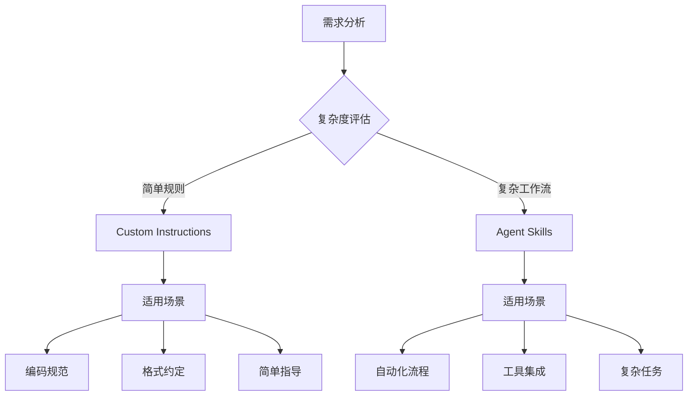

# Agent Skills vs Custom Instructions 对比指南

> 📚 **完整指南**：帮助开发者理解 Agent Skills 和 Custom Instructions 的区别，以及如何选择和使用它们。

## 📑 目录

- [🤖 什么是 Agent Skills？](#-什么是-agent-skills)
- [📋 核心对比分析](#-核心对比分析)
- [🔍 为什么需要 Skills？](#-为什么有了-instructions-还需要-skills)
- [🎯 三级加载机制](#-skills-的三级智能加载机制)
- [🛠️ 应用场景对比](#️-实际应用场景对比)
- [📋 SKILL.md 文件结构](#-skillmd-文件结构示例)
- [🆚 使用示例对比](#-实际使用对比示例)
- [⚡ 性能效率对比](#-性能和效率对比)
- [🎯 选择指南](#-选择指南)
- [🌟 最佳实践](#-最佳实践建议)
- [🚀 快速开始](#-快速开始指南)
- [📚 延伸阅读](#-延伸阅读)

---

## 🤖 什么是 Agent Skills？

**Agent Skills（智能体技能）** 是包含指令、脚本和资源的文件夹，GitHub Copilot 可以在相关时加载这些技能来执行专业化任务。简单来说，技能就是教会 AI 做特定事情的**「能力包」**。

### 🌐 跨平台支持

技能采用 [开放标准](https://agentskills.io/)，可以在多个AI代理之间移植使用：

| 平台 | 支持状态 | 功能范围 |
|------|---------|----------|
| **GitHub Copilot in VS Code** | ✅ 完全支持 | 聊天模式 + 代理模式 |
| **GitHub Copilot CLI** | ✅ 完全支持 | 终端环境集成 |
| **GitHub Copilot Coding Agent** | ✅ 完全支持 | 自动化编码任务 |
| **其他兼容代理** | ✅ 标准支持 | 基于 agentskills.io 标准 |

---

## 📋 核心对比分析

### 📊 功能特性对比表

| 🎯 对比维度 | 🚀 Agent Skills | 📝 Custom Instructions | 🏆 优势方 |
|-----------|-----------------|------------------------|----------|
| **主要目的** | 教授专门的能力和复杂工作流程 | 定义基础编码标准和简单指南 | Skills |
| **跨平台兼容** | ✅ VS Code + CLI + Coding Agent + 其他 | ❌ 仅限 VS Code 和 GitHub.com | Skills |
| **内容丰富度** | ✅ 指令+脚本+示例+配置+模板 | ❌ 仅限纯文本指令 | Skills |
| **加载策略** | ✅ 智能按需加载，零上下文浪费 | ⚠️ 始终加载或简单文件过滤 | Skills |
| **标准化程度** | ✅ 国际开放标准 (agentskills.io) | ❌ 平台特定格式 | Skills |
| **工作流复杂度** | ✅ 支持多步骤复杂自动化流程 | ⚠️ 仅适合简单规则和约定 | Skills |
| **社区生态** | ✅ 标准化共享，生态丰富 | ❌ 平台局限，难以复用 | Skills |
| **学习成本** | ⚠️ 需要学习 YAML 和文件结构 | ✅ 简单直接，立即上手 | Instructions |
| **设置速度** | ⚠️ 需要创建文件夹和多个文件 | ✅ 单文件快速配置 | Instructions |

### 💡 核心差异总结



---

## 🔍 为什么有了 Instructions 还需要 Skills？

### 🚧 Custom Instructions 的核心局限

<details>
<summary>📝 点击展开详细分析</summary>

| 限制类型 | 具体问题 | 影响范围 | 解决方案 |
|---------|---------|----------|----------|
| **📄 内容局限** | 仅支持纯文本指令 | 无法包含脚本、配置、示例 | 使用 Skills 的多文件结构 |
| **🔗 平台绑定** | VS Code 和 GitHub 专有 | 无法跨工具、跨平台使用 | Skills 的开放标准 |
| **⚡ 加载策略** | 静态全量加载 | 始终占用上下文空间 | Skills 的按需加载 |
| **📦 可扩展性** | 难以附加资源文件 | 无法提供模板和工具 | Skills 的资源文件夹 |
| **🔄 维护性** | 单一文件管理 | 复杂规则难以组织 | Skills 的模块化结构 |

</details>

### 🚀 Agent Skills 的核心优势

#### 1. 📦 多媒体能力包
```
技能文件夹结构：
├── 📋 SKILL.md           # 指令和说明
├── 🔧 scripts/           # 可执行脚本
├── 📁 templates/         # 代码模板
├── ⚙️ config/            # 配置文件
├── 💡 examples/          # 实际示例
└── 📚 docs/              # 详细文档
```

#### 2. 🧠 智能按需加载
```
上下文管理：
┌─────────────────────────────────────┐
│  😴 休眠状态：仅元数据占用 < 1KB      │
│  🔍 发现阶段：根据描述判断相关性       │
│  📖 激活状态：加载完整指令内容         │
│  🔧 执行阶段：按需访问具体资源         │
└─────────────────────────────────────┘
```

#### 3. 🌐 跨平台标准化
- **一次编写** → 多平台使用
- **版本控制** → Git 友好的文件结构
- **团队协作** → 标准化的共享格式
- **社区生态** → 丰富的技能市场

#### 4. 🔄 渐进式加载机制
高效的三级加载系统，详见下一节分析。

---

## 🎯 Skills 的三级智能加载机制

```
第1级：技能发现（始终可用）
┌─────────────────────────┐
│ 读取技能名称和描述信息    │ ← 轻量级元数据，帮助AI决策
│ name: web-testing       │
│ description: 自动化测试  │
└─────────────────────────┘
                ↓
第2级：指令加载（按需激活）
┌─────────────────────────┐
│ 加载SKILL.md完整内容     │ ← 详细指令和操作步骤
│ - 测试流程指导          │
│ - 操作步骤说明          │
│ - 最佳实践建议          │
└─────────────────────────┘
                ↓
第3级：资源访问（需要时才加载）
┌─────────────────────────┐
│ 访问脚本和示例文件       │ ← 额外资源文件
│ - test-template.js      │
│ - config/jest.config.js │
│ - examples/login-test.js│
└─────────────────────────┘
```

这种机制确保可以安装很多技能而不消耗上下文，只有相关的技能才会被激活。

---

## 🛠️ 实际应用场景对比

### 📝 Custom Instructions 适用场景

**用于定义编码规范和约定：**
```markdown
## 项目编码规范指令
- 使用分号结尾
- 字符串统一使用单引号
- React组件优先使用函数式组件
- 回调函数使用箭头函数语法
- 遵循Tailwind CSS样式规范
```

### 🚀 Agent Skills 适用场景

**1. Web应用测试技能包**
```
.github/skills/webapp-testing/
├── SKILL.md              # 测试指令和流程说明
├── test-template.js      # Jest测试模板脚本
├── examples/             # 实际测试示例
│   ├── login-test.js     # 登录功能测试
│   ├── api-test.js       # API接口测试
│   └── e2e-test.js       # 端到端测试
├── config/               # 测试配置文件
│   ├── jest.config.js    # Jest配置
│   └── playwright.config.js # Playwright配置
└── utils/                # 测试工具函数
    ├── test-helpers.js
    └── mock-data.js
```

**2. GitHub Actions调试技能包**
```
.github/skills/github-actions-debug/
├── SKILL.md              # 调试流程指南
├── scripts/              # 调试脚本工具
│   ├── check-workflow.sh # 工作流检查脚本
│   ├── analyze-logs.py   # 日志分析工具
│   └── fix-common-issues.sh # 常见问题修复
├── templates/            # 工作流模板
│   ├── debug-workflow.yml # 调试工作流模板
│   └── test-ci.yml       # 测试CI模板
└── docs/                 # 相关文档
    ├── troubleshooting.md # 故障排除指南
    └── best-practices.md  # 最佳实践
```

---

## 📋 SKILL.md 文件结构示例

```markdown
---
name: react-component-generator
description: 生成标准化的React组件，包含组件代码、样式、测试和文档的完整解决方案
---

# React组件生成器技能

## 🎯 功能说明
这个技能帮助你快速生成标准化的React组件：
- 🏗️ 自动创建组件结构
- 🎨 生成配套样式文件
- 🧪 创建测试文件
- 📚 生成组件文档
- ♿ 确保可访问性支持

## 📋 使用场景
- 新功能组件开发
- 组件库建设
- 标准化团队开发流程
- 快速原型构建

## 🔧 操作步骤
1. **分析组件需求** - 确定组件功能和API设计
2. **生成组件代码** - 使用[组件模板](./component-template.jsx)
3. **创建样式文件** - 基于[样式模板](./styles-template.module.css)
4. **生成测试文件** - 使用[测试模板](./test-template.test.js)
5. **更新文档** - 基于[文档模板](./docs-template.md)
6. **集成到项目** - 更新索引文件和类型定义

## 💡 示例用法
参考以下示例了解如何使用：
- [按钮组件示例](./examples/Button/)
- [输入框组件示例](./examples/Input/)
- [模态框组件示例](./examples/Modal/)

## 🔗 相关资源
- [React组件设计原则](./docs/design-principles.md)
- [样式规范指南](./docs/style-guide.md)
- [测试最佳实践](./docs/testing-guide.md)
```

---

## 🆚 实际使用对比示例

### 使用 Custom Instructions 处理简单规范：

```markdown
## 代码风格指令文件
- 函数命名采用驼峰命名法
- 常量使用大写加下划线
- 文件名使用kebab-case格式
- 导入语句按字母顺序排列
- 每个文件末尾保留一个空行
```

### 使用 Agent Skills 处理复杂工作流：

**技能激活过程：**
```
用户输入："帮我创建一个用户登录组件"

第1级 - AI扫描可用技能：
✅ react-component-generator: "生成React组件..."
❌ web-testing: "自动化测试..."
❌ api-integration: "API集成..."

第2级 - 加载相关技能指令：
加载 react-component-generator/SKILL.md

第3级 - 按需访问资源：
- 读取 component-template.jsx
- 加载 test-template.test.js
- 获取 styles-template.module.css
- 参考 examples/Button/ 示例

输出：完整的登录组件 + 样式 + 测试 + 文档
```

---

## ⚡ 性能和效率对比

### Custom Instructions
```
✅ 优点：
- 简单快速设置
- 立即生效
- 适合基础规范

❌ 缺点：
- 始终占用上下文空间
- 无法包含复杂逻辑
- 难以维护和更新
- 功能有限
```

### Agent Skills
```
✅ 优点：
- 按需加载，节省上下文
- 支持复杂多步骤工作流
- 包含丰富的资源文件
- 易于维护和版本控制
- 可跨平台使用
- 社区共享和协作

⚠️ 注意点：
- 初始设置稍复杂
- 需要学习SKILL.md格式
- 目前仍在预览阶段
```

---

## 🎯 选择指南

### 何时使用 Custom Instructions：
- ✅ 设置项目级编码标准
- ✅ 定义语言或框架约定
- ✅ 指定代码审查和提交规则
- ✅ 简单的样式和格式要求
- ✅ 需要在所有对话中始终应用的规则

### 何时使用 Agent Skills：
- ✅ 创建可复用的跨工具能力
- ✅ 需要包含脚本、示例等资源
- ✅ 希望与社区共享能力
- ✅ 定义专门的工作流程（测试、调试、部署）
- ✅ 构建复杂的多步骤自动化流程
- ✅ 需要条件化和智能化的功能激活

---

## 🌟 最佳实践建议

### 组合使用策略：
1. **Instructions 定基础** - 用于设定项目的基本编码规范
2. **Skills 添能力** - 用于增强特定领域的专业能力
3. **互补协作** - 两者结合使用，发挥各自优势

### 技能开发建议：
- 📝 **明确描述** - 技能描述要具体，帮助AI准确判断何时使用
- 🔗 **模块化设计** - 将复杂功能拆分为多个独立技能
- 📚 **丰富示例** - 提供充足的使用示例和模板
- 🧪 **充分测试** - 在不同场景下测试技能的有效性
- 📖 **详细文档** - 为技能提供清晰的使用文档

---

## � 快速开始指南

### ⏱️ 5分钟上手 Agent Skills

#### 第一步：启用 Skills 功能
```bash
# 在 VS Code 中启用预览功能
# 设置 → 搜索 "chat.useAgentSkills" → 启用
```

#### 第二步：创建你的第一个技能
```bash
# 1. 在项目根目录创建技能文件夹
mkdir -p .github/skills/my-first-skill

# 2. 创建技能定义文件
touch .github/skills/my-first-skill/SKILL.md
```

#### 第三步：编写技能内容
```yaml
---
name: my-first-skill
description: 我的第一个 Agent 技能，用于演示基本功能
---

# 我的第一个技能

## 功能说明
这个技能演示如何创建基本的 Agent 技能。

## 使用方法
1. 在聊天中描述相关任务
2. AI 会自动激活此技能
3. 按照技能指导完成任务
```

#### 第四步：测试技能
```bash
# 在 VS Code 中打开 Copilot Chat
# 输入与你的技能相关的问题
# 观察 AI 是否自动激活了你的技能
```

### 📋 常用技能模板

<details>
<summary>🧪 <strong>测试技能模板</strong></summary>

```yaml
---
name: testing-helper
description: 帮助创建和运行各种类型的测试
---

# 测试助手技能

## 支持的测试类型
- 单元测试 (Jest/Vitest)
- 集成测试
- E2E 测试 (Playwright/Cypress)
- API 测试

## 使用示例
参考 [测试模板](./templates/test-template.js)
```

</details>

<details>
<summary>🚀 <strong>部署技能模板</strong></summary>

```yaml
---
name: deployment-helper
description: 简化应用部署流程，支持多种平台
---

# 部署助手技能

## 支持的平台
- Vercel
- Netlify 
- AWS
- Docker

## 部署检查清单
1. 环境变量配置
2. 构建优化
3. 安全检查
4. 性能监控
```

</details>

### 🎯 推荐学习路径

1. **🟢 初学者**：从简单的编码规范 Instructions 开始
2. **🟡 进阶者**：尝试创建第一个 Skills，如代码生成器
3. **🔴 高级用户**：开发复杂的工作流 Skills，集成多个工具
4. **🎓 专家级**：贡献开源技能，建设社区生态

---

## 📚 延伸阅读

### 📖 官方文档
- [🏠 VS Code Agent Skills 官方文档](https://code.visualstudio.com/docs/copilot/customization/agent-skills)
- [🌐 Agent Skills 开放标准](https://agentskills.io/)
- [📝 GitHub Copilot 自定义指令](https://code.visualstudio.com/docs/copilot/customization/custom-instructions)

### 🛠️ 实用资源
- [🌟 GitHub 社区技能库](https://github.com/github/awesome-copilot)
- [🔬 Anthropic 参考技能库](https://github.com/anthropics/skills)
- [📋 技能开发最佳实践](https://agentskills.io/best-practices)

### 🎓 学习资源
- [📺 Skills 开发视频教程](https://www.youtube.com/results?search_query=agent+skills+github+copilot)
- [💬 社区讨论论坛](https://github.com/github/copilot-docs/discussions)
- [🐛 问题报告和反馈](https://github.com/github/copilot-docs/issues)

---

*本文档更新日期：2026年1月20日*
